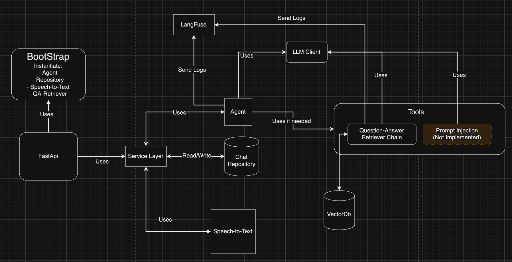

# Technical Document

## Table of Contents

1. [System Architecture and Design Decisions](#system-architecture-and-design-decisions)
2. [RAG Implementation Details](#rag-implementation-details)
3. [Vector Database Setup and Usage](#vector-database-setup-and-usage)
4. [Deployment Procedure](#deployment-procedure)
5. [Known Limitations and Potential Improvements](#known-limitations-and-potential-improvements)

---

## How to test the application

1. Update the **endpoint.http** file with the address of the deployed application.
2. Run the first endpoint to create a conversation, this will return a **conversation_id**.

3. With the **conversation_id**, run the second endpoint to send a message to the conversation.

4. Repeat step 3 as many times as needed to send multiple messages to the conversation.

5. Run the third endpoint to send an audio message to the conversation. For the moment, the audio file must be in the same directory as the endpoint.http file, and the only supported format is **m4a**.

## 1. System Architecture and Design Decisions

### 1.1 Overview

The system is designed to facilitate seamless conversations and interactions through a chat service. It leverages a
hexagonal architecture (also known as ports and adapters architecture) to ensure a clean separation of concerns, making
the system highly modular, testable, and maintainable.

### 1.2 Purpose:

- To manage and store chat conversations.
- To transcribe audio inputs into text.
- To handle user queries and provide appropriate responses.

### 1.3 Architecture:

### 1.3 Capabilities:

- Chat Management: The system can save and retrieve chat conversations using a repository pattern.
- Audio Transcription: It can transcribe audio files into text using an external transcription service.
- Query Handling: The system processes user queries and maintains conversation history to provide contextually relevant
  responses.

The architecture ensures that the core business logic is isolated from external dependencies, allowing for easy
integration with different services and technologies.

### 1.4 Design Decisions

#### Choice of Programming Languages and Frameworks

**Programming Language: Python**

The choice of Python as the programming language is driven by several factors:

- **Rich Ecosystem**:
  Python provides a rich ecosystem of libraries and frameworks, especially in the domain of machine learning and NLP.
  Libraries such as TensorFlow, PyTorch, and Hugging Face streamline model development, training, and deployment.

- **Community and Support**:
  Python has a large and active community, which means extensive support, documentation, and tools are readily
  available. This can significantly reduce development time and facilitate easier debugging and enhancement.

- **Ease of Use**:
  Python's syntax is clean and readable, which aids in rapid development and easier maintenance. This is particularly
  important when working with complex systems that integrate multiple components.

#### Frameworks and Libraries

1. **LangChain**:

- **Role**: LangChain is used to create and orchestrate chains and agents for handling different tasks.
- **LangChain Agents**:
- **Functionality**: These agents enable the system to decide dynamically whether to use the Retrieval-Augmented
  Generation (RAG) system (LangChain chains) or to respond directly using the default language model.
- **Flexibility**: This decision-making process enhances the system's flexibility to either fetch relevant data from
  external sources or generate responses based on the default generative model, depending on the query type.

2. **LangChain Chains**:

- **Role**: Chains in LangChain, specifically the `RetrievalQA` chain, are employed for handling complex queries that
  benefit from information retrieval.
- **Implementation**: The chain uses Pinecone as the vector database retriever, allowing efficient search and retrieval
  processes.

3. **Pinecone**:

- **Role**: Acts as the vector database for storing and retrieving high-dimensional embeddings of text.
- **Functionality**: Pinecone facilitates fast similarity searches, which is crucial for the performance of the RAG
  system. It enhances the system's ability to find relevant documents quickly and accurately.

4. **OpenAI Whisper Model via API**:

- **Role**: Whisper is used for speech-to-text transformation.
- **Functionality**: By leveraging OpenAI's Whisper model via API, the system can accurately transcribe audio inputs.
  This transcribed text can then be processed further by the language models or chains.

5. **Langfuse**:

- **Role**: Langfuse is used for logging and monitoring the interaction process.
- **Functionality**: It helps in capturing detailed logs of the interactions, which can be useful for debugging,
  performance monitoring, and maintaining a history of conversations.

6. **DynamoDB**:

- **Role**: DynamoDB is employed to store the history of conversations.
- **Functionality**: As a NoSQL database, DynamoDB provides scalable and low-latency storage. Storing conversation
  history allows the system to maintain context across interactions, improving the coherence and relevance of responses.

#### Integration and Design Choice Implications

- **Decision-Making Flexibility**:
  By using LangChain agents, the system adapts to the needs of the query dynamically, choosing between straightforward
  generation via the default language model or an enriched response through the RAG system. This adaptability ensures
  that the system can handle a wide variety of queries efficiently.

- **Efficient Retrieval**:
  The integration of Pinecone for vector database management ensures that the retrieval operations are optimized for
  speed and accuracy. This is critical for applications that require real-time or near-real-time responses.

- **Robust Transcription**:
  Incorporating OpenAI's Whisper model ensures high-quality speech-to-text conversion, expanding the system's usability
  to voice-based inputs.

- **Scalable Storage**:
  Using DynamoDB for conversation history provides a scalable, managed storage solution that can grow with application
  demand without compromising on performance.

- **Comprehensive Monitoring**:
  Langfuse enhances the system's observability, making it easier to track interactions, identify anomalies, and gather
  insights for further improvements.

The combination of these components and design decisions creates a robust, flexible, and efficient system capable of
delivering high-quality responses across various types of queries and interactions. This design ensures scalability,
ease of maintenance, and the ability to continuously improve through detailed monitoring and analysis.

---

## 2. RAG Implementation Details

### 2.1 Implementation Details

A Retrieval-Augmented Generation (RAG) system combines retrieval-based and generation-based approaches to improve the
quality and relevance of responses.
in the adapter retriever.py, we are using LangChain chains, chains are used to create a sequence of operations that can
handle both retrieval and generation tasks, next we will describe the main components of the RAG system implemented in
LangChain.

1. **Language Models (LMs)**:

- **Library Used**: `langchain_core.language_models`
- **Role**: LMs serve as the backbone for generating text. In the code, a `BaseChatModel` from the `language_models`
  module is employed. These models are designed to understand natural language input and generate coherent, contextually
  appropriate responses.

2. **Embedding Models**:

- **Library Used**: `langchain.embeddings.openai.OpenAIEmbeddings`
- **Role**: Embedding models transform textual inputs into high-dimensional vectors that capture semantic meaning. Here,
  the `OpenAIEmbeddings` class is utilized. Embeddings are crucial in matching queries with relevant pieces of
  information stored in the vector database. We used **text-embedding-ada-002** as the default embedding model.

3. **Vector Databases**:

- **Library Used**: `langchain_community.vectorstores.Pinecone`
- **Role**: A vector database indexes and stores embeddings of text data, allowing for efficient similarity searches.
  The `Pinecone` class integrates Pinecone’s vector database services, which can search and retrieve relevant
  information quickly based on the embeddings generated from the textual queries.

4. **Retrieval Mechanism**:

- **Library Used**: Pinecone's internal querying mechanism
- **Role**: The retriever component is responsible for fetching the most relevant documents from the vector database
  based on the query embedding. This retrieval ensures that the generative model has access to pertinent context or
  facts.

---

## 3. Vector Database Setup and Usage

### 3.2 Setup Instructions

For setting up a vector database like Pinecone to be used with document embeddings generated by OpenAI's models, several
prerequisites and installation steps need to be considered.

#### Prerequisites

1. **API Keys**:

- Pinecone API Key: Required for authenticating and interacting with the Pinecone service.
- OpenAI API Key: Needed to access OpenAI’s embeddings models for generating vector representations of text data.

2. **Environment Variables**:

- Store API keys and other configuration parameters securely using environment variables or a `.env` file to avoid
  hardcoding sensitive information into your scripts.

3. **Python Environment**:

- Ensure Python and pip are installed. It is recommended to use a virtual environment to manage dependencies.

4. **Libraries**:

- The following libraries are required and can be installed using pip:
- `dotenv` for loading environment variables from a `.env` file.
- `PyPDFLoader` from `langchain_community` for loading and processing PDF documents.
- `OpenAIEmbeddings` from `langchain_openai` for generating embeddings using OpenAI's models.
- `PineconeVectorStore` from `langchain_pinecone` for managing the interaction with the Pinecone vector database.
- `CharacterTextSplitter` from `langchain_text_splitters` for splitting text into manageable chunks.

### 3.3 Usage Guidelines

Once the environment is set up and the necessary libraries are installed, the process of upserting documents into the
vector database involves several key steps:

#### Document Loading and Splitting

1. **Loading Documents**:

- The `PyPDFLoader` library is used to load PDF files. This library helps in extracting the textual content from the
  PDF, making it ready for further processing.

2. **Splitting Text**:

- The textual content extracted from the documents is often too large to be processed in one go. To handle this,
  the `CharacterTextSplitter` class is employed.
- This class splits the text into smaller chunks based on character count, ensuring that each chunk is of a manageable
  size. The chunk size and the overlap between consecutive chunks can be adjusted as needed to ensure that important
  contextual information isn't lost.

#### Generating Embeddings

3. **Embedding Generation**:

- The `OpenAIEmbeddings` class from the `langchain_openai` library is used to generate embeddings for each text chunk.
- An embedding is a high-dimensional vector that represents the textual data in a form suitable for similarity searches.
- Using a model like `text-embedding-ada-002`, these embeddings capture the semantic meaning of the text, allowing for
  effective search and retrieval operations based on similarity.

#### Upserting Data into Pinecone

4. **Vector Store Interaction**:

- The `PineconeVectorStore` class from the `langchain_pinecone` library is then used to interact with the Pinecone
  vector database.
- The embeddings, along with the corresponding metadata (such as text chunks), are upserted into the Pinecone index.
  Upserting means updating existing records or inserting new ones if they do not already exist.
- The `from_documents` method of `PineconeVectorStore` automates the insertion process by taking the list of documents
  and their embeddings and handling the upsertion seamlessly.

#### Summary

Combining these steps, we effectively convert raw textual data from PDFs into a structured form that can be stored and
queried efficiently in a vector database. This involves:

1. Extracting text from documents using `PyPDFLoader`.
2. Splitting the extracted text into manageable chunks using `CharacterTextSplitter`.
3. Generating embeddings for these text chunks using `OpenAIEmbeddings`.
4. Upserting these embeddings into the Pinecone vector database using `PineconeVectorStore`.

These processes ensure that the data is indexed in such a way that allows for efficient and accurate retrieval,
leveraging the powerful capabilities of vector embeddings and Pinecone's indexing mechanisms.

## 4. Deployment Procedure

### 4.1 Deployment Steps

#### Overview

Deploying an application involves preparing the environment, configuring necessary files, and executing commands to
launch the services required to run the application. While the process described here is manual, it sets the foundation
for further automation through Continuous Integration and Continuous Deployment (CICD) pipelines in the future.

#### Step-by-Step Guide

##### 1. Environment Setup

- **Provisioning EC2 Instance**:
- The first step is to provision an EC2 instance on Amazon Web Services (AWS). In this case, an Ubuntu t2.micro instance
  is chosen, which is cost-effective and sufficient for small-scale applications or initial testing.
- Ensure you have the appropriate security group settings, allowing SSH access for setup and HTTP/HTTPS access for your
  application's web services.

- **Install Essential Packages**:
- Once the EC2 instance is up and running, SSH into the instance using the provided key pair.
- Update the system package list to ensure that all packages are up-to-date.
- Install essential packages and dependencies such as Python, pip, and virtual environment for isolating Python
  dependencies.

- **Nginx Installation**:
- Nginx is used as a web server to handle incoming HTTP/HTTPS requests and to serve as a reverse proxy to forward
  requests to Gunicorn.
- Install Nginx and ensure it is set to start on boot.

- **Gunicorn Installation**:
- Gunicorn (Green Unicorn) is an HTTP server for running Python web applications. It is particularly effective for WSGI
  applications.
- Install Gunicorn via pip within your Python virtual environment.

##### 2. Configuration File Adjustments

- **Nginx Configuration**:
- Nginx configuration files need to be adjusted to route incoming requests to Gunicorn. This involves creating or
  modifying a server block configuration.
- Ensure that the server block points to the correct domain or IP address and specifies the port Gunicorn is listening
  on (typically port 8000).

- **Gunicorn Configuration**:
- Create a Gunicorn configuration file where you can define settings such as the number of worker processes, binding IP
  address and port, logging configurations, and more.
- This configuration ensures that Gunicorn runs optimally given the resources of the t2.micro instance.

- **Application Configuration**:
- Adjust your application’s configuration files as necessary. This might involve setting environment variables,
  specifying database connections, API keys, etc.
- Ensure your Python dependencies are installed in the virtual environment by using a requirements file.

##### 3. Execution of Deployment Scripts or Commands

- **Starting Gunicorn**:
- Manually start Gunicorn with the appropriate command, usually specifying the WSGI application entry point.
- Ensure that Gunicorn is set up to run as a daemon, keeping it active even after closing the SSH session.

- **Configuring Nginx**:
- Test the Nginx configuration for syntax errors.
- Reload Nginx to apply the new configuration.

- **Verifying Service**:
- Once Nginx and Gunicorn are running, test the application by accessing it via the browser using the public IP or
  domain.
- Check logs in both Nginx and Gunicorn to ensure there are no errors and the application is serving requests as
  expected.

#### Additional Notes

Although this process is currently manual, each step serves as a foundation for future automation. Implementing CICD can
streamline these operations by automatically provisioning instances, deploying code, and configuring services whenever
changes are pushed to the repository.

In future iterations, tools like AWS CodePipeline, Docker, and Kubernetes can be introduced to automate the deployment,
enhance scalability, and manage the application lifecycle more efficiently.

By understanding the manual process in detail, one gains the necessary insights to configure and optimize each step,
forming a robust baseline for advanced automation and deployment strategies.

---

## 5. Known Limitations and Potential Improvements

### 5.1 Known Limitations

1. **Token Limit Constraints**:

- **Issue**: One significant limitation observed is the problem associated with token limits, especially when dealing
  with long conversations. Language models like those provided by OpenAI have a maximum token limit, which, when
  exceeded, results in the truncation of the input or output sequences.
- **Impact**: This can lead to incomplete responses or the loss of valuable contextual information, thereby impacting
  the coherence and relevance of the responses generated over long interactions.

2. **Manual Deployment**:

- **Issue**: The current deployment process is manual, involving multiple steps that need to be executed sequentially.
  This can be time-consuming and prone to human error.
- **Impact**: This limits the scalability and elasticity of the system, making it difficult to quickly deploy updates or
  handle increased loads efficiently.

3. **Security Vulnerabilities**:

- **Issue**: Prompt injection attacks can be a concern. Malicious users may attempt to inject harmful commands or data
  through the system's prompt, potentially leading to undesirable or insecure states.
- **Impact**: This jeopardizes the reliability and security of the application, making it critical to implement
  protective measures against such vulnerabilities.

### 5.2 Potential Improvements

1. **Managing Long Conversations**

**Summarization**:

- **Description**: Implementing a summarization layer can help maintain context over long conversations by periodically
  summarizing the dialogue and feeding these summaries back into the model. This effectively compresses the amount of
  information while retaining the key points, thereby staying within the token limits.
- **Benefits**: This approach helps in maintaining the context and continuity of long interactions without hitting token
  limits.

**Entity Tracking with LangChain**:

- **Description**: Another technique to manage historical conversations is using entity tracking, where key entities
  mentioned in the conversation are extracted and stored separately. This allows the system to reference these entities
  when needed, instead of maintaining the entire conversation history.
- **Benefits**: This can reduce the amount of redundant information being fed into the model and ensure that important
  details are not lost over the course of long conversations.

2. **Preventing Prompt Injection**

**Validation and Sanitization**:

- **Description**: Implementing robust input validation and sanitization mechanisms to filter out potentially harmful
  data before it is processed by the language model.
- **Benefits**: This minimizes the risk of prompt injection attacks and ensures that only clean, safe inputs reach the
  processing layers.

**Use of Policies and Guards**:

- **Description**: Setting up policies and guard mechanisms within LangChain to detect and neutralize potentially
  malicious inputs or suspicious activity.
- **Benefits**: This enhances the security and reliability of the system by actively protecting against known and
  emerging threats.

3. **CI/CD Implementation**

**Short-term Strategy**:

- **Description**: Begin by automating the most repetitive parts of the deployment process, such as provisioning the EC2
  instance and installing base dependencies.
- **Tools**: Tools like AWS CloudFormation or Terraform can be used to script the environment setup.
- **Benefits**: Reduces the time and effort required for deployments and minimizes human error.

**Long-term Strategy**:

- **Description**: Fully automate the deployment pipeline using CI/CD tools like AWS CodePipeline, Jenkins, or GitHub
  Actions.
- **Benefits**: This ensures seamless integration and deployment, allowing for quick and reliable updates to the
  application. It also improves the scalability and manageability of the deployment process, accommodating growth and
  changes more efficiently.

By addressing these known limitations and implementing the proposed improvements, the system can significantly enhance
its performance, reliability, and scalability, delivering a more robust and user-friendly experience.